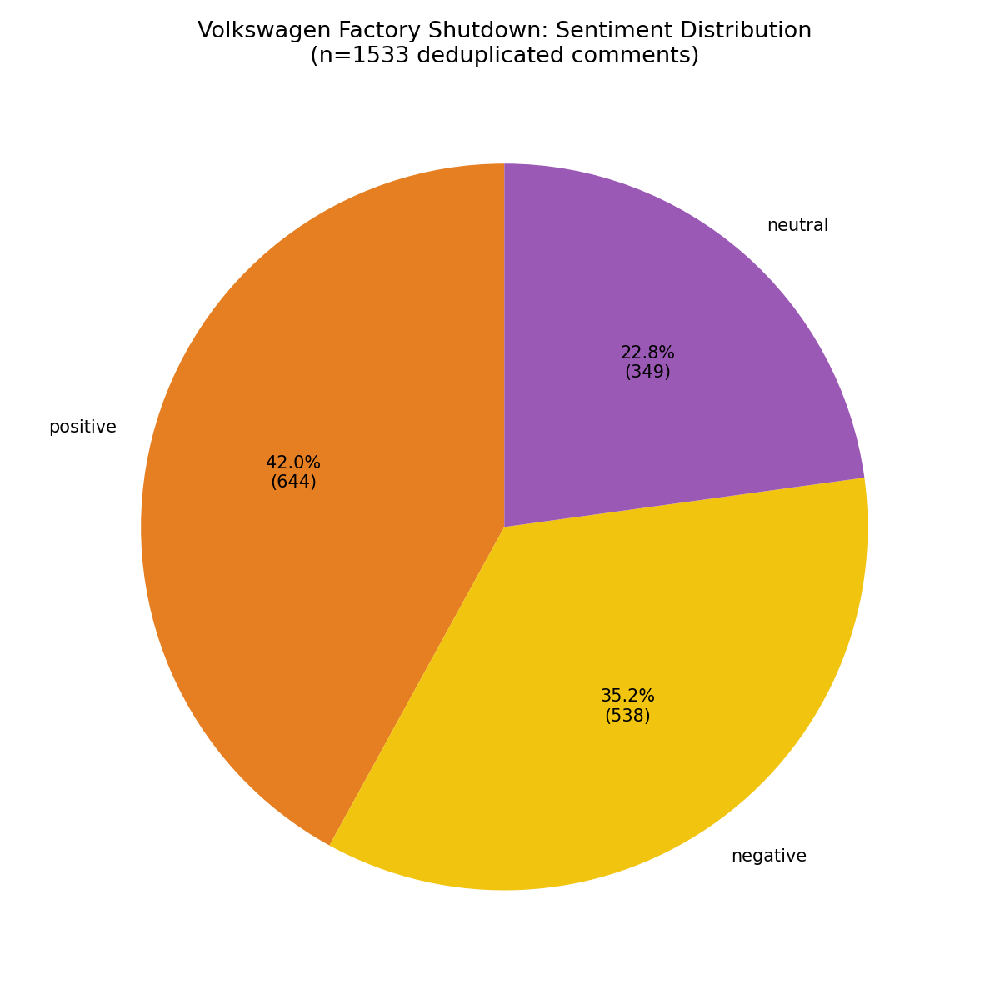
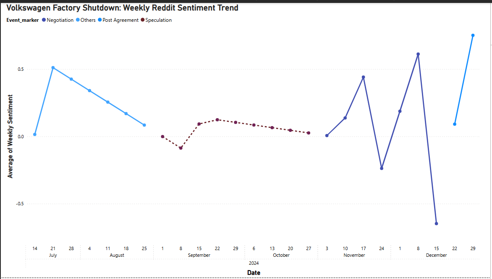
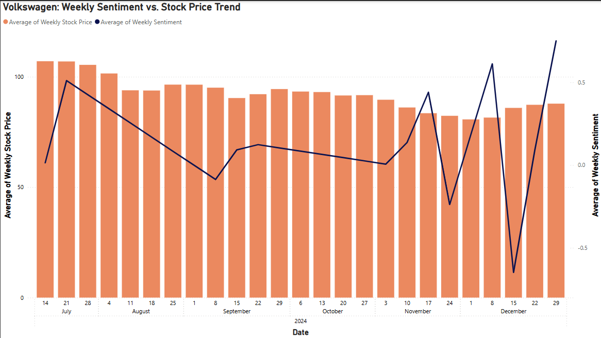
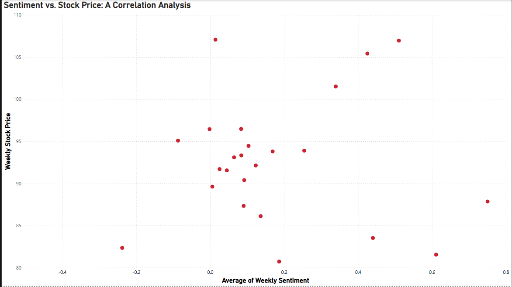

# Using Sentiment Analysis to Analyse Company Reputation: A Volkswagen Case Study

MSc Data Analytics and Information Systems Management — Final Dissertation Project

This project investigates whether public sentiment on social media moves together with a company's stock price, using **Volkswagen's December 2024 German factory shutdown and layoff announcement** as the event case study. It combines **Reddit data collection**, **NLP-based sentiment scoring (VADER)**, and **stock market data (Yahoo Finance)** to explore the relationship between online public opinion and corporate reputation.

---

## Project Overview

Corporate reputation shapes investor confidence, customer trust, and brand value. This project asks: **does what people say online about a company actually track with how the market values that company?**

Using Volkswagen's factory shutdown announcement as a real, high-visibility event, the project collects and analyses Reddit discussion across the run-up, negotiation, and aftermath of the announcement, and compares weekly sentiment trends against VW's weekly stock price (VOW3.DE).

**Research Questions**
- **RQ1:** How does public sentiment change during key events for the company?
- **RQ2:** Can social media sentiment influence a company's reputation, as reflected by stock price?
- **RQ3:** What visual insights can be derived from sentiment trend analysis?

**Hypotheses**
- **H₀:** There is no significant relationship between social media sentiment and Volkswagen's stock price.
- **H₁:** There is a significant relationship between social media sentiment and Volkswagen's stock price.

---

## Data & Methodology

| Stage | Tool / Library | What it does |
|---|---|---|
| 1. Reddit post collection | `praw` | Searches 10 relevant subreddits (Volkswagen, cars, autos, news, Europe, Germany, electricvehicles, worldnews, autonews, AskEurope) using 20 event-related keywords |
| 2. Relevance filtering | `pandas` | Strict keyword filter on titles narrows results to the posts most clearly discussing the shutdown |
| 3. Comment extraction | `praw` | Pulls all comments from the relevant posts (raw scrape) |
| 4. Cleaning & sentiment scoring | `vaderSentiment`, `pandas` | Normalizes text, removes duplicates, and scores each comment as positive / negative / neutral → **1,533 unique labeled comments** (per dissertation §3.4.1, reduced from 18,625 raw comments after cleaning) |
| 5. Stock data collection | `yfinance` | Downloads daily VW stock price (ticker `VOW3.DE`), July 2024 – April 2025 |
| 6. Weekly merge & interpolation | `pandas` | Resamples sentiment and stock data to weekly averages and aligns them for comparison |
| 7. Correlation & visualization | `pandas`, `matplotlib`, Power BI | Tests the sentiment–stock relationship (Pearson correlation) and visualizes trends |

The event timeline (July–December 2024) was segmented into four phases — **Others (baseline)**, **Speculation**, **Negotiation**, and **Post Agreement** — to track how sentiment shifted as the story developed.

> Full methodology, literature review, and statistical testing are documented in [`docs/Dissertation_Full_Report.pdf`](docs/Dissertation_Full_Report.pdf).

---

## Key Findings

**Sentiment distribution** across the cleaned comment set: ~42% positive, ~35% negative, ~23% neutral — a more mixed reaction than the negative headline news alone would suggest.



**Weekly sentiment trend**, segmented by event phase — sentiment dipped during early speculation, swung sharply during negotiation, and rebounded after the agreement was finalized:



**Sentiment vs. stock price**, side by side — some visible alignment during the Speculation phase, though not a consistent pattern across the full timeline:



**Correlation analysis** — Pearson correlation was tested across two windows, per the dissertation (§4.4):
- **Overall (July–December 2024):** r = +0.0326, p = 0.9118 — not statistically significant.
- **Speculation Phase only (Sep 1–Oct 28, 2024):** r = -0.2374, p = 0.8474 — also not statistically significant, though visually a tighter, downward-sloping cluster of points during this phase.

Both fail to reject H₀: no significant **linear** relationship between weekly sentiment and stock price. This doesn't rule out a non-linear or delayed relationship — the Pearson test only speaks to linear association — though visual inspection of the scatter plot suggests some temporary co-movement during parts of the Speculation phase specifically.



*(A supplementary re-run of this test on the processed weekly file included in this repo — `data/weekly_sentiment_vs_stock.csv`, which spans a few weeks further than the dissertation's official window — gives r ≈ 0.09, p ≈ 0.66. The exact coefficient differs slightly from the officially submitted result above, most likely due to using a different snapshot of the weekly-aggregated data, but the conclusion is identical: no statistically significant linear relationship. See [`notebooks/analysis.ipynb`](notebooks/analysis.ipynb) for this reproducible version.)*

---

## Repository Structure

```
├── src/                                    # Analysis pipeline, in order
│   ├── 01_reddit_post_collection.py        # Scrape posts via PRAW
│   ├── 02_filter_relevant_posts.py         # Keyword-filter for relevance
│   ├── 03_comment_extraction.py            # Pull comments from relevant posts
│   ├── 04_sentiment_analysis_vader.py      # VADER sentiment scoring
│   ├── 05_stock_price_collection.py        # Download VW stock data (yfinance)
│   ├── 06_merge_weekly_sentiment_stock.py  # Weekly resample, align, correlate
│   └── 07_top_posts_by_sentiment.py        # Most-discussed post per sentiment class
├── notebooks/
│   └── analysis.ipynb                      # Runnable notebook: correlation test + all charts, with real output
├── data/                                   # Processed data (see "About the Data" below)
│   ├── weekly_sentiment_vs_stock.csv       # Weekly aggregated sentiment + stock price (28 weeks)
│   ├── volkswagen_stock_data.csv           # Daily VW (VOW3.DE) stock price, Jul 2024 – Apr 2025
│   └── sample_reddit_comments_sentiment.csv # 150-comment sample with VADER scores
├── results/                                # Exported charts (Power BI)
├── docs/
│   ├── Dissertation_Full_Report.pdf        # Full written dissertation
│   └── references.md                       # Academic references
├── requirements.txt
└── README.md
```

## About the Data

The full scraped comment set isn't redistributed in this repo, in line with Reddit's API terms on sharing collected data. Per the dissertation (§3.4.1), preprocessing reduced 18,625 raw comments to 1,533 unique, deduplicated entries. Instead of the full raw set, `data/` includes:
- the **fully processed, aggregated weekly dataset** used for the correlation analysis (no personal data — just weekly averages), and
- a **150-comment representative sample** (public comment text + VADER scores) so the notebook is runnable end-to-end without needing your own Reddit API credentials.

The `src/` scripts document the main stages of the original workflow and are chained via saved intermediate CSV/Excel files (each script writes what the next one reads), so running `01` → `07` in order with your own Reddit API credentials will reproduce the pipeline end-to-end. Note this reconstructs the workflow rather than replaying the exact original run — a fresh Reddit scrape today will return different posts/comments than the ones used in the dissertation.

## Tech Stack

`Python` · `pandas` · `PRAW` (Reddit API) · `VADER Sentiment` · `yfinance` · `matplotlib` · `Power BI` · `Excel`

## Running the Pipeline

```bash
pip install -r requirements.txt
```

**Fastest way to see it work:** open `notebooks/analysis.ipynb` — it runs entirely on the processed data already included in `data/`, no API keys required.

**To reproduce the full pipeline from raw data:** each script in `src/` corresponds to one stage, in order (01 → 07), and is chained via saved intermediate files. You'll need your own Reddit API credentials (`client_id`, `client_secret`) from [reddit.com/prefs/apps](https://www.reddit.com/prefs/apps) — set them as environment variables (e.g. `REDDIT_CLIENT_ID`, `REDDIT_CLIENT_SECRET`) rather than hardcoding them. Never commit real API credentials to a public repo. Note that a fresh scrape today will pull different, more recent posts than the ones used in the dissertation.

## Limitations & Future Work

- Reddit is only one social platform; results may not generalize to X/Twitter, news comment sections, or broader public opinion.
- **Data-quality note (found while assembling this repository, not part of the original submitted methodology):** while auditing the source files for this repo, the raw comment export was found to contain 20,374 rows — more than the dissertation's reported pre-deduplication count of 18,625 — with one Reddit post's comments appearing roughly 225 times over. The cause wasn't investigated further and isn't established. It's not something the dissertation discusses, since the dissertation's own preprocessing step (§3.4.1: 18,625 raw → 1,533 unique) already removes duplicate comment text, so it doesn't change the reported results. It's noted here only for transparency, since it surfaced while preparing this repo.
- VADER is a general-purpose lexicon model — a domain-tuned or transformer-based model (e.g. BERT) could improve accuracy on automotive-industry-specific language.
- Stock price is an imperfect proxy for "reputation" — it's affected by many confounding factors beyond public sentiment.
- Both the dissertation's official Pearson tests and this repository's supplementary re-run share the same underlying issue: weekly sentiment and stock price are both time-ordered (autocorrelated) series, which violates the independence assumption Pearson relies on, and the small sample size (this repo's supplementary analysis uses 28 weekly observations) limits statistical power in either case. Non-linear or lagged-effect models (e.g. cross-correlation with time lags, or a proper time-series model) could capture delayed market reactions and avoid that assumption more rigorously.

## Author

**Devika Krishnan** — MSc Data Analytics and Information Systems Management, Arden University, Berlin

---

*This repository accompanies my master's dissertation.*
